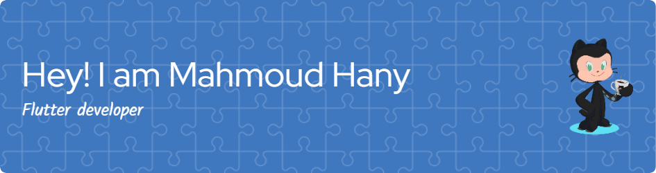

<h1 align="center">Hi 👋, I'm Mahmoud Hany</h1>
<h3 align="center">Flutter Developer</h3>
<!-- 

 -->

  

##  About me

  	  
- I am a Studient at [*`Faculty of Computers & Informatics`*](http://suez.edu.eg/ar/%d9%83%d9%84%d9%8a%d8%a9-%d8%a7%d9%84%d8%ad%d8%a7%d8%b3%d8%a8%d8%a7%d8%aa-%d9%88%d8%a7%d9%84%d9%85%d8%b9%d9%84%d9%88%d9%85%d8%a7%d8%aa/) at [*`Suez Canal University`*](http://suez.edu.eg/ar/). 
- 👨‍💻I am a competitive programmer at [*`codeforces`*](https://codeforces.com/profile/7oodaaa)
- :student: I’m currently learning `Computer Science` and `Software Engineering`.
- 📫 How to reach me **`mahmoud.hany.attia@gmail.com`**
    
	  
 #
 

	

##  Connect with me

	  
	
	
	
	
	
	
      

##  My Skills
	
###  Programming languages

 
  &emsp; 

      

</body>
